# LABORATORIO 4: – Uso de BiTalino para EMG y ECG
## Tabla de contenidos
1. Introduccion
2. Objetivos
3. Materiales y equipos
4. Resultados
5. Bibliografía 
## Introducción
Un electrocardiograma, comúnmente conocido como ECG o EKG, es una prueba médica no invasiva que registra la actividad eléctrica del corazón a lo largo del tiempo. Este examen utiliza electrodos colocados en la piel del paciente para detectar y graficar las señales eléctricas generadas por el corazón durante cada latido. El resultado es un trazado gráfico que muestra la ritmicidad y la función eléctrica del corazón, lo que ayuda a los médicos a diagnosticar trastornos cardíacos, como arritmias, infartos y otros problemas relacionados con la actividad cardíaca.
Tres electrodos permitirán registrar una sola derivación, generalmente conocida como “derivación unipolar”. Aunque esto puede brindar información básica sobre la actividad eléctrica del corazón, es importante destacar que un ECG de 3 electrodos es menos preciso para detectar ciertos trastornos cardíacos en comparación con un ECG de 12 derivaciones, que proporciona una imagen más completa del funcionamiento cardíaco. Por lo tanto, es recomendable utilizar un ECG de 12 derivaciones cuando sea posible para obtener un diagnóstico más completo y preciso.

## Objetivos
- Obtener una señal ECG empleando tres electrodos
- Evaluar la diferencia en la señales ECG en reposo y en actividad 
- Identificar las partes características de una señal ECG con un equipo patron
## Materiales y equipos
Se emplearán los siguientes componentes:
- Bitalino, hardware en conjunto con software Opensignals
- 3 electrodos convencionales
- Equipo simulador Fluke ProSim4
## Procedimiento
1. Inicializar software y configurar bitalino
2. Posicionar los electrodos en el cuerpo del paciente de acuerdo a la Derivación I.
 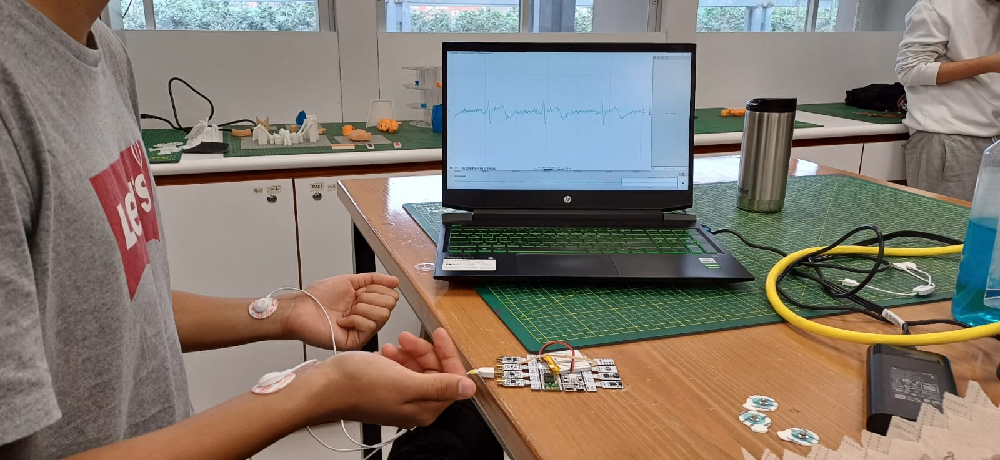
3. Realizar las pruebas: Reposo, Mantener la respiración y Realizar actividad física. 
4. Verificar las mediciones y preparan para postprocesamiento
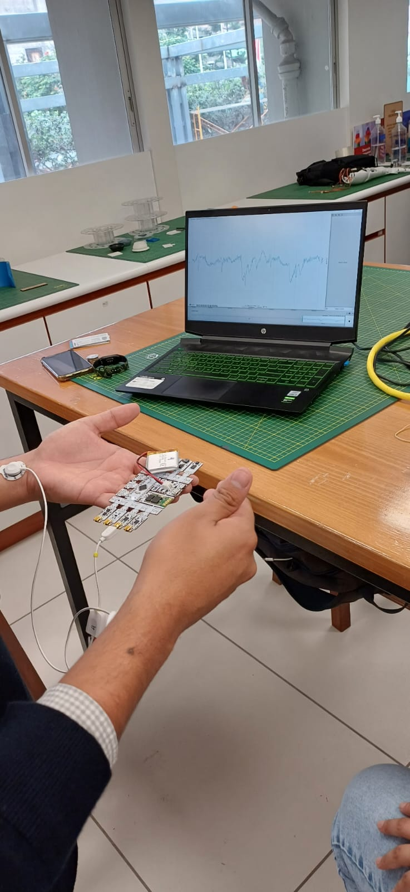
5. Repetir el proceso colocando las derivaciones en el equipo Prosim
 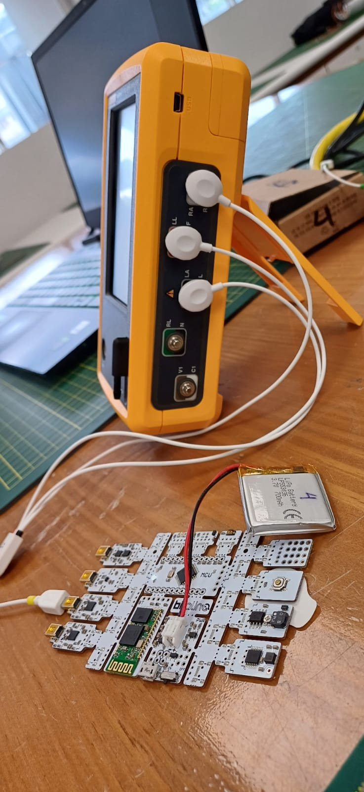
6. Procesar las señales para identificar la señal ECG

## Resultados
## Ploteo de las señales
1. Estado en reposo
- Para el primer usuario:
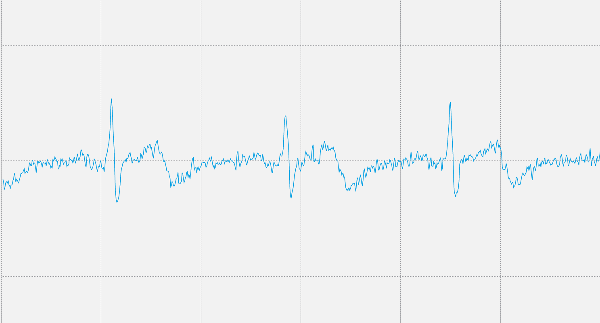
- Para el segundo usuario:
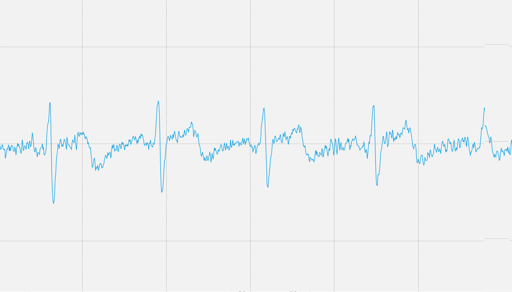
2. Manteniendo la respiración
- Para el primer usuario:

- Para el segundo usuario:
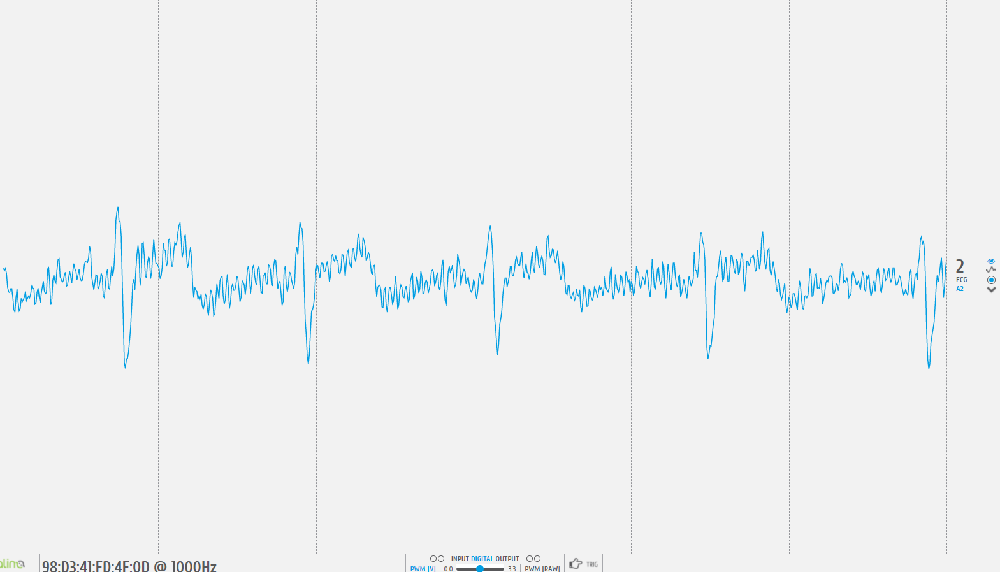
3. Después de una actividad física
- Para el primer usuario:
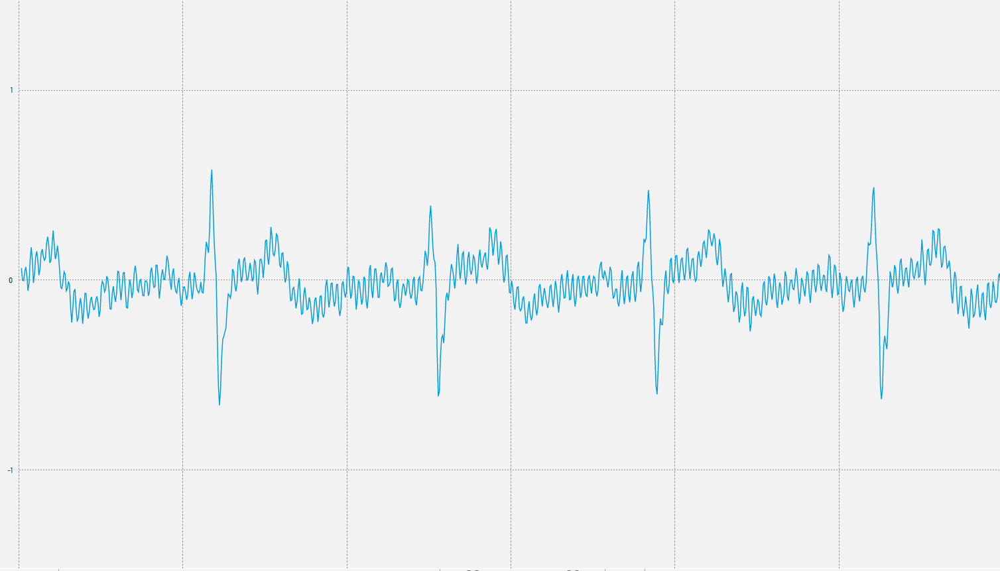
- Para el segundo usuario:
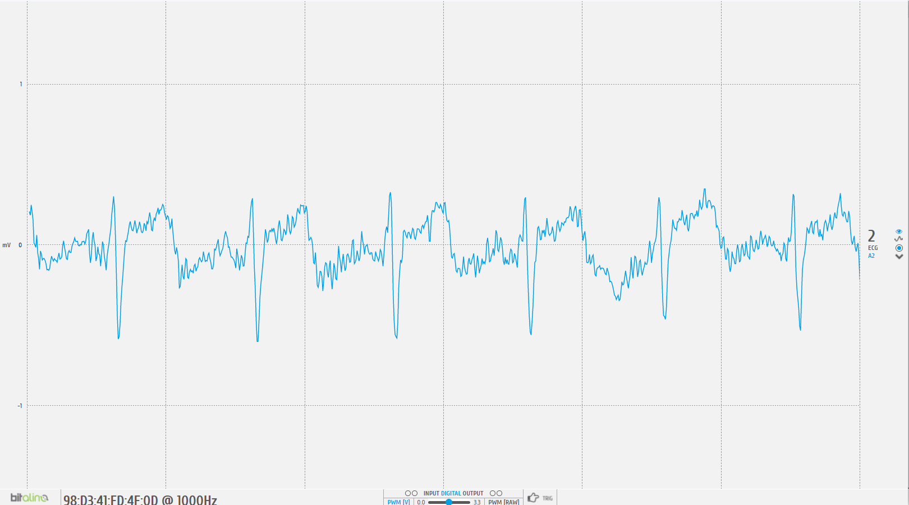
## Ploteo de la señal en Python
1. Estado en reposo
- Para el primer usuario:
En este punto hubieron fallas con la computadora que estuvo grabando la señal, por lo que, no se grabaron adecuadamente.
- Para el segundo usuario:
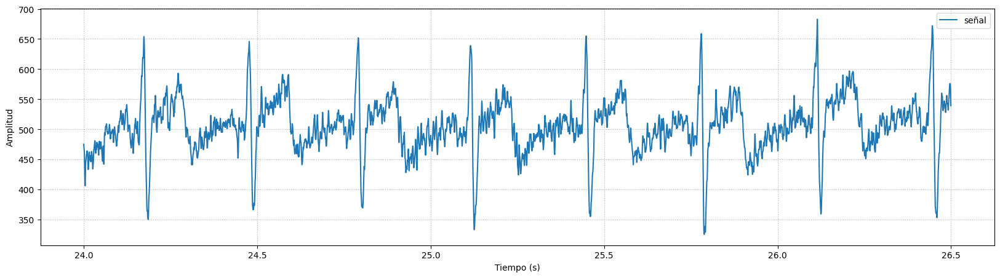
2. Manteniendo la respiración
La retención de la respiración puede tener un impacto en el ECG. Cuando una persona detiene la respiración, el corazón se ve obligado a trabajar más arduamente para bombear sangre a través del cuerpo. Esto puede ocasionar alteraciones en el patrón del ritmo cardíaco, el tamaño de las ondas registradas y la duración de los intervalos.
Las modificaciones más frecuentes que se observan en un ECG cuando se retiene la respiración son las siguientes: Incremento de la amplitud de las ondas P, QRS y T; Reducción de la longitud del intervalo PR y el aumento de la frecuencia cardíaca. [1]
- Para el primer usuario:
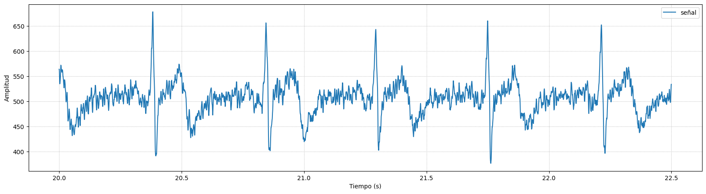
- Para el segundo usuario:
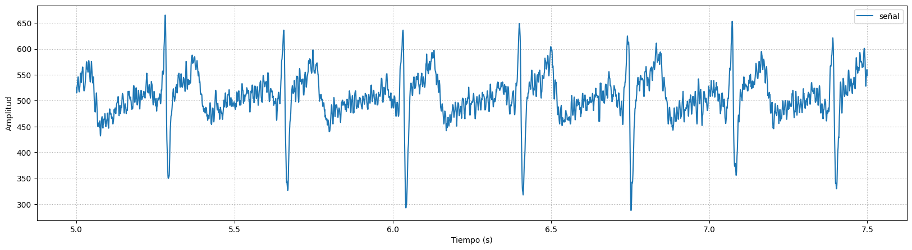

3. Después de una actividad física
Como se menciono en el efecto de aguantar la respiración sobre el ECG, ocurre lo mismo después de realizar actividad física y tendrá los mismos efectos mencionados. [2]
- Para el primer usuario:
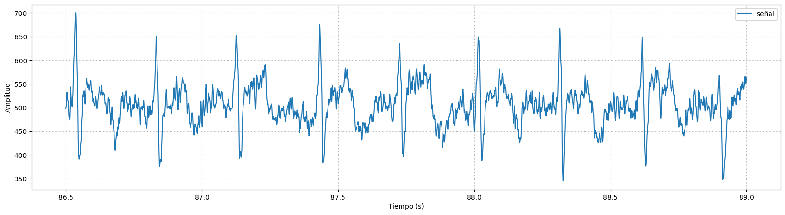
- Para el segundo usuario:
En este punto hubieron fallas con la computadora que estuvo grabando la señal, por lo que, no se grabaron adecuadamente.

### Simulador
1. Simulación de Fluke Biomedical-Prosim 4 en modo ¨Cardiac arrest¨
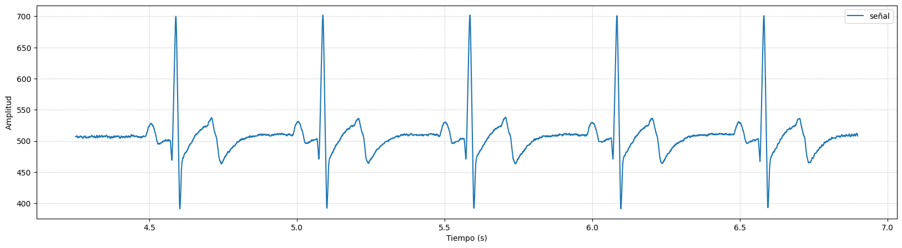

2. Simulación de Fluke Biomedical-Prosim 4 en modo ¨Exercise¨
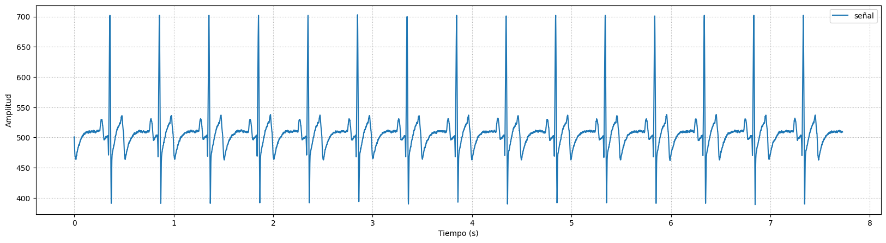

## Analísis en decibeles de las señales
1. Estado en reposo
- Para el primer usuario:
En este punto hubieron fallas con la computadora que estuvo grabando la señal, por lo que, no se grabaron adecuadamente.
- Para el segundo usuario:
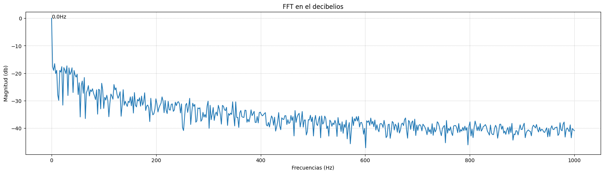
2. Manteniendo la respiración:
- Para el primer usuario:
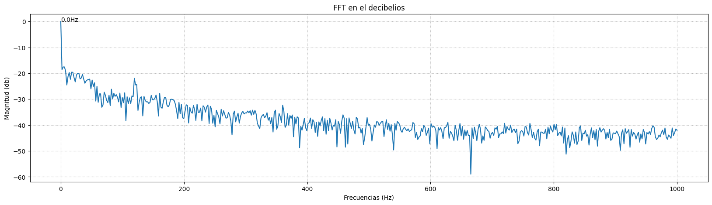
- Para el segundo usuario:
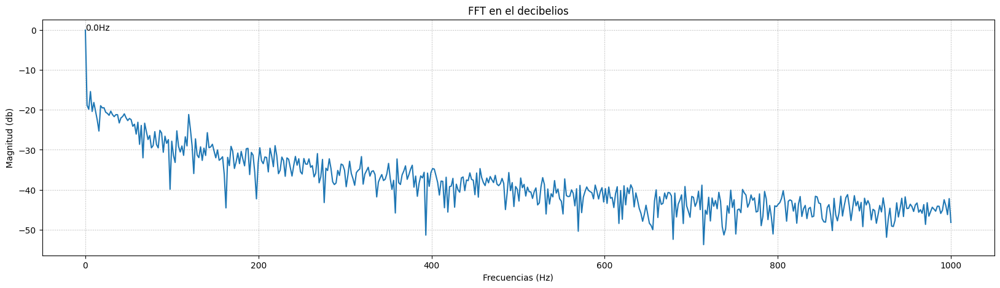
3. Después de una actividad física:
- Para el primer usuario:
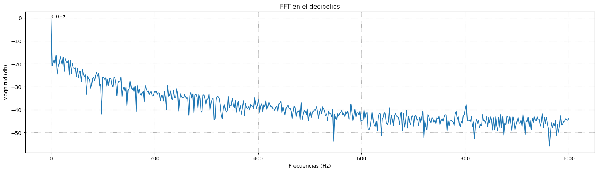
- Para el segundo usuario:
En este punto hubieron fallas con la computadora que estuvo grabando la señal, por lo que, no se grabaron adecuadamente.
### Simulador
1. Simulación de Fluke Biomedical-Prosim 4 
modo ¨Cardiac arrest¨
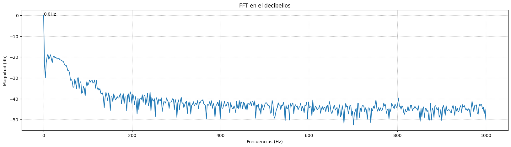

2. Simulación de Fluke Biomedical-Prosim 4 en modo ¨Exercise¨
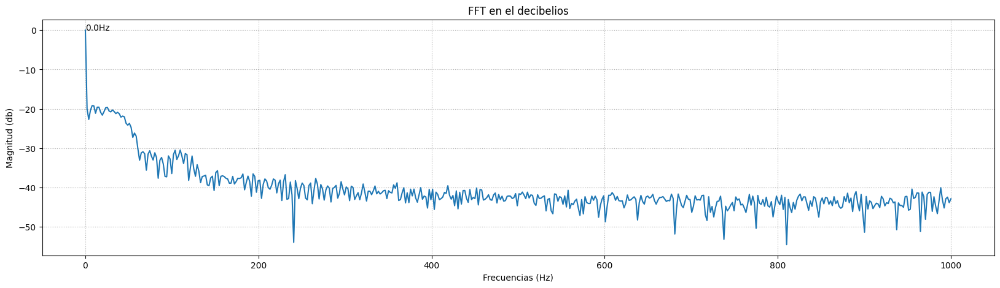

## Respuesta en frecuencia de las señales
1. Estado en reposo:
- Para el primer usuario:
En este punto hubieron fallas con la computadora que estuvo grabando la señal, por lo que, no se grabaron adecuadamente.
- Para el segundo usuario

2. Manteniendo la respiración:
- Para el primer usuario

- Para el segundo usuario
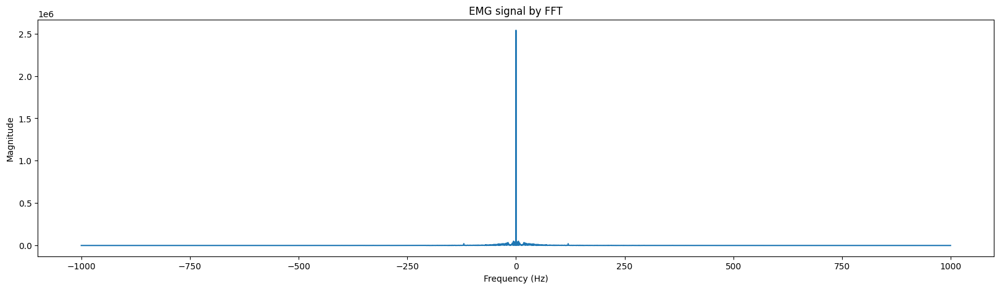
3. Después de una actividad física:
- Para el primer usuario

- Para el segundo usuario
En este punto hubieron fallas con la computadora que estuvo grabando la señal, por lo que, no se grabaron adecuadamente.
### Simulador
1. Simulación de Fluke Biomedical-Prosim 4 en modo ¨Cardiac arrest¨
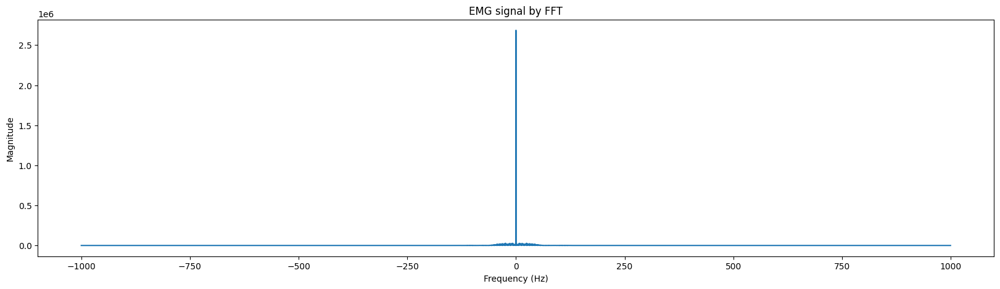

2. Simulación de Fluke Biomedical-Prosim 4 en modo ¨Exercise¨
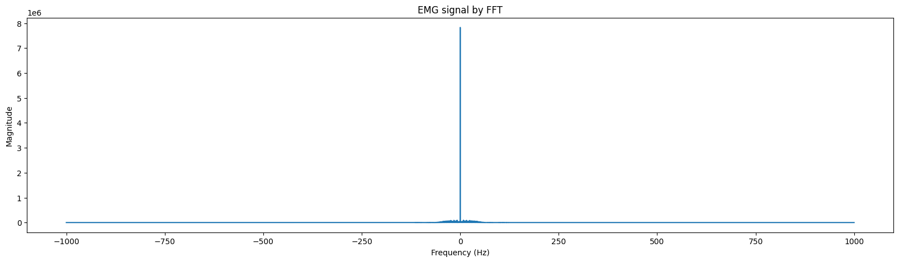

## Conclusiones y limitaciones
* El electrocardiograma brinda información sobre el comportamiento del corazón cuando la persona se encuentra en reposo con una respiración normal (señal de referencia), luego cuando realiza una serie de respiraciones (manteniendo la respiración por 30 segundos) y finalmente, después de haber realizado actividad física (trotar a diferentes velocidades). Asimismo, se observó en las gráficas la variación del electrocardiograma en función a la actividad respiratoria de la persona.

* Se logró identificar las diferencias y obtener los patrones de la frecuencia cardiaca utilizando el módulo de BITalino y el software de Python. 

* La comparación de la señal obtenida mediante la señal patrón del dispositivo Fluke-ProSim 4 muestran resultados similares en cuanto al modo Exercise y la prueba de actividad física.

* La principal limitación está relacionada al ambiente de pruebas, ya que al ser en un salón se obtuvo bastante ruido de por medio. Para evitar ello, se recomienda realizar las pruebas en un ambiente controlado y con un protocolo estándar para obtener resultados sólidos.

* Otra de las limitaciones que influyeron en los resultados es que los cables del módulo BITalino y los electrodos a veces se despegaban debido al movimiento al realizar la actividad física, por lo que no se adquiría completamente los datos del electrocardiograma. Se recomienda utilizar unos cables más largos y utilizar el pocket del módulo para mayor comodidad del participante y obtener mejores resultados.

## Bibliografia
- [1]Smit, D., de Cock, C. C., Thijs, A., & Smulders, Y. M. (2009). Effects of breath-holding position on the QRS amplitudes in the routine electrocardiogram. Journal of electrocardiology, 42(5), 400–404. https://doi.org/10.1016/j.jelectrocard.2009.04.006
- [2]Simoons, M. L., & Hugenholtz, P. G. (1975). Gradual changes of ECG waveform during and after exercise in normal subjects. Circulation, 52(4), 570–577. https://doi.org/10.1161/01.cir.52.4.570