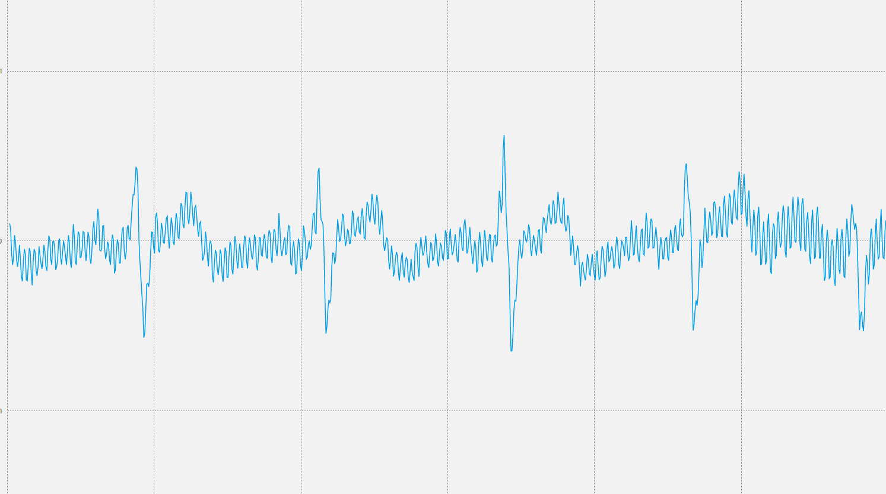

# LABORATORIO 4: – Uso de BiTalino para EMG y ECG
## Tabla de contenidos
1. 
2. 
3. 
## Introducción
## Objetivos
## Materiales y equipos
## Procedimiento
## Resultados
## Ploteo de las señales
1. Estado en reposo
- Para el primer usuario:

- Para el segundo usuario:

2. Manteniendo la respiración
- Para el primer usuario:

- Para el segundo usuario:

3. Después de una actividad física
- Para el primer usuario:

- Para el segundo usuario:

## Ploteo de la señal en Python
1. Estado en reposo
- Para el primer usuario:
En este punto hubieron fallas con la computadora que estuvo grabando la señal, por lo que, no se grabaron adecuadamente.
- Para el segundo usuario:

2. Manteniendo la respiración
La retención de la respiración puede tener un impacto en el ECG. Cuando una persona detiene la respiración, el corazón se ve obligado a trabajar más arduamente para bombear sangre a través del cuerpo. Esto puede ocasionar alteraciones en el patrón del ritmo cardíaco, el tamaño de las ondas registradas y la duración de los intervalos.
Las modificaciones más frecuentes que se observan en un ECG cuando se retiene la respiración son las siguientes: Incremento de la amplitud de las ondas P, QRS y T; Reducción de la longitud del intervalo PR y el aumento de la frecuencia cardíaca. [1]
- Para el primer usuario:

- Para el segundo usuario:

3. Después de una actividad física
Como se menciono en el efecto de aguantar la respiración sobre el ECG, ocurre lo mismo después de realizar actividad física y tendrá los mismos efectos mencionados. [2]
- Para el primer usuario:

- Para el segundo usuario:
En este punto hubieron fallas con la computadora que estuvo grabando la señal, por lo que, no se grabaron adecuadamente.
## Analísis en decibeles de las señales
1. Estado en reposo
- Para el primer usuario:
En este punto hubieron fallas con la computadora que estuvo grabando la señal, por lo que, no se grabaron adecuadamente.
- Para el segundo usuario:

2. Manteniendo la respiración:
- Para el primer usuario:

- Para el segundo usuario:
En este punto hubieron fallas con la computadora que estuvo grabando la señal, por lo que, no se grabaron adecuadamente.
3. Después de una actividad física:
- Para el primer usuario:

- Para el segundo usuario:
En este punto hubieron fallas con la computadora que estuvo grabando la señal, por lo que, no se grabaron adecuadamente.
## Respuesta en frecuencia de las señales
1. Estado en reposo:
- Para el primer usuario
En este punto hubieron fallas con la computadora que estuvo grabando la señal, por lo que, no se grabaron adecuadamente.
- Para el segundo usuario

2. Manteniendo la respiración:
- Para el primer usuario

- Para el segundo usuario
3. Después de una actividad física:
- Para el primer usuario

- Para el segundo usuario
En este punto hubieron fallas con la computadora que estuvo grabando la señal, por lo que, no se grabaron adecuadamente.
## Bibliografia
- [1]Smit, D., de Cock, C. C., Thijs, A., & Smulders, Y. M. (2009). Effects of breath-holding position on the QRS amplitudes in the routine electrocardiogram. Journal of electrocardiology, 42(5), 400–404. https://doi.org/10.1016/j.jelectrocard.2009.04.006
- [2]Simoons, M. L., & Hugenholtz, P. G. (1975). Gradual changes of ECG waveform during and after exercise in normal subjects. Circulation, 52(4), 570–577. https://doi.org/10.1161/01.cir.52.4.570