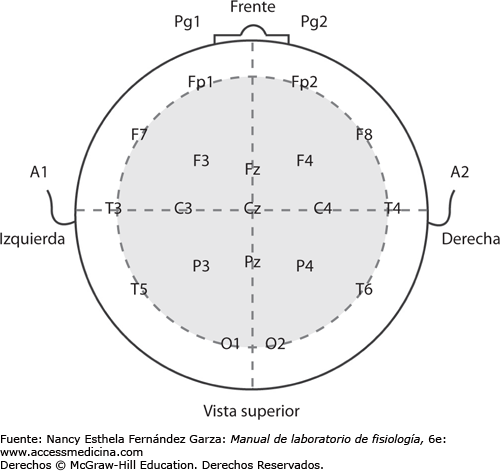
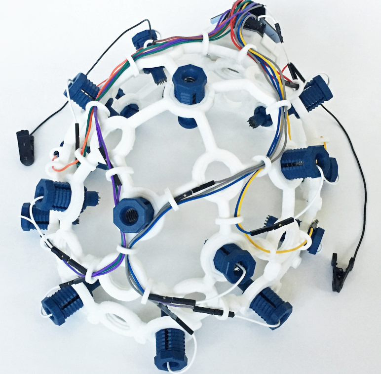
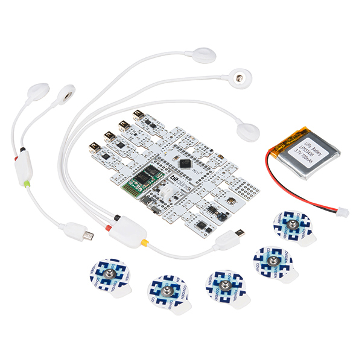

# Laboratorio 5 - Adquisición de señales de ECG

## Tabla de contenido
- [Introducción](#Introducción_al_laboratorio )
- [Materiales](#Materiales)
- [Metodología](#Metodología)
- [Resultados y discusión](#Resultadosydiscusión)
- [Conclusiones](#Conclusiones) 
- [Bibliografía](#Bibliografía)

## Introducción al laboratorio 
El presente laboratorio consiste en el uso del encefalograma (ECG) para adquirir y analizar las respuestas electricas del cerebro de los participantes. Esto se realizo mediante el uso del módulo Bitalino y el Ultracortex MarK IV. EL EEG son señales producidas por la actividad sinaptica de las neuronas y sirve para diferentes actividades entre las que destacan son el diagnositco de tumores cerebrales, encefalitis herpética, ACV, daños cerebrales por contusiones, encefalopatia y epilepsia.

El EEG usa electrodos, los cuales se colocan según el sistema 10-20 en el cuero cabelludo como se puede apreciar en la siguiente imagen. Cabe destacar que el CZ, C3 y C4 son los electrodos. [1]

Figura 1. Sistema 10-20

El EEG consiste de 6 bandas de paso y cada una indica una función especifica del cerebro: [2]
- Delta 0.5Hz - 4Hz
- Theta 4Hz - 7.5 Hz
- Alpha 8Hz - 12Hz
- Beta 14Hz - 26Hz
- Gamma >30Hz
- Sigma 12Hz - 15Hz
## Materiales
| Materiales | Imagen referencial | 
|----------|----------|
|**Ultracortex Mark IV:** El Ultracortex es un casco de código abierto que se puede imprimir en 3D y ha sido desarrollado para ser compatible con el sistema OpenBCI. Este dispositivo es capaz de capturar señales de alta calidad utilizadas en investigaciones, incluyendo la actividad cerebral (EEG), la actividad muscular (EMG) y la actividad cardíaca (ECG). |  | 
| **BITalino:** Placa encaragda de la adquisición de señales tales como EEG, ECG y EMG. Además, incluye un software llamado Open source para la visualización de las señales.    |   | 
| **Laptop:** Dispositivo que posea los sowftware de visualización instalados.    |   | 
| **Electrodos:** Parche que contiene pegamento y filamentos metalicos que permiten la conducción de señales electricas del paciente hacia el dispositivo de medición.        |  |

## Metodología
La adquisición de señales EEG fue realizada utilizando 2 dispositivos: Ultracortex MarK IV y el módulo de Bitalino. La colocación de cada uno de ellos se realizó tal como se observan en las siguientes imágenes de acuerdo al dispositivo utilizado.

Figura 2. Colocación de Ultracortex [3]

Figura 3. Colocación de Bitalino [4]
  
Posteriormente, las señales se adquirieron siguiendo el siguiente protocolo:
1. Registrar una línea base de señal con poco ruido y sin movimientos (respiración normal,sin movimientos oculares/ojos cerrados) durante 30 segundos.
2. Realizar un ciclo de 5 segundos para OJOS ABIERTOS y otro ciclo de 5 segundos para OJOS CERRADOS. En total se debe registrar 5 repeticiones de cada uno.
3. Registrar otra fase de referencia de 30 segundos (paso 1).
4. Uno de los compañeros debe leer en voz alta una serie de ejercicios matemáticos (https://doi.org/10.3758/s13415-019-00703-5)  y el sujeto de prueba debe resuelver cada uno de ellos mentalmente enfocando su mirada en un punto rojo para evitar artefactos [5].
5. Detenga la grabación y guarde sus datos

## Resultados y discusión

- Basal:

En el estado basal se observa que la señal obtenida se mantiene constante a lo largo del tiempo. Esto se debe a que la persona se encuentra en sentada en reposo con los ojos cerrados durante 30 segundos. Asimismo, se observa que hay 1 pico de onda cuadrada, el cual representa el cierre de los ojos.

 

 <video src="Videos/Estado%20basal.mp4" controls title="Title"></video>

- Abrir y cerrar ojos:

 En el gráfico se observa que la señal presenta un primer tramo con varios picos de ondas cuadradas, esto se debe a que la persona parpadeaba mientras veía el punto fijo de color rojo. En el segundo tramo se observan que la señal se mantiene constante y hay 2 picos de ondas cuadradas, el primero de ellos representa el cierre de los parpados y el segundo pico representa la apertura de los ojos.

 

<video src="Videos/cerrando_ojos.mp4" controls title="Title"></video>

- Preguntas simples y complejas:

        
        
        
        
        
 Para el caso de las preguntas simples se puede observar que no hay mucha actividad en las ondas, ya que las preguntas se pueden responder de manera rapida y precisa, sin necesitar de mucho ejercicio mental. En cambio, en las preguntas complejas hay mucha más amplitud debido a que hay una mayor actividad cerebral para analizar y responder cada pregunta. En este caso es importante destacar que los resultados obtenidos no presentan valores negativos, lo cual resulta curioso, ya que la amplitud de los milivoltios debería abarcar el intervalo positivo y negativo, además, en el archivo .txt todos los resultados son positivos, por lo que, se puede intuir que hubo un problema durante la recolección de datos. Asimismo, se debería esperar según la bibliografia encontrada que hayan ondas cerebrales de alta frecuencia y amplitud en las preguntas complejas, ya que son indicativas de que existe un mayor nivel de actividad cerebral. Específicamente, en estas situaciones, se han identificado dos tipos de ondas cerebrales:

- Las ondas beta, que oscilan entre 13 y 30 Hz, se relacionan con la actividad cerebral consciente y alerta. Se ha observado un aumento en la actividad beta en las áreas del cerebro encargadas del cálculo y la resolución de problemas.[6]

- Las ondas gamma, con una frecuencia entre 30 y 100 Hz, se asocian con el procesamiento complejo de información en el cerebro. En preguntas de cálculo complejo, se ha notado un incremento en la actividad gamma en regiones cerebrales responsables del pensamiento, la memoria y la atención.[6]
   
<video src="Videos/pregutnass.mp4" controls title="Title"></video>

## Conclusiones
- Se pudo observar la actividad cerebral que implica realizar un calculo mental, sobre todo, cuando hay picos grandes de milivoltios en el EEG.
- Las ondas gama y beta son las que se necesitan observar y comparar cuando se realizan calculos mentales de alto y baja nivel de complejidad.
- Se notó que las señales EEG adquiridas del UltraCortex eran inusuales o atípicas en su forma, lo que sugiere que podrían haber estado afectadas por varios factores, como interferencias eléctricas, envio de datos por via inalambrica o  mala adherencia del dispositivo con el sujeto. Esta rareza en las señales contribuyó a la dificultad para obtener información útil del Ultracortex.
- El uso del módulo Bitalino para registrar señales EEG proporciona una herramienta valiosa para comprender la actividad cerebral en diferentes estados y condiciones. Los hallazgos resaltan la capacidad de este sistema para detectar cambios en la actividad cerebral asociados con la apertura, cierre de los ojos y el parpadear. Estos resultados pueden ser de interés en investigaciones para analizar el funcionamiento del cerebro en diversas situaciones y frente a ciertos estímulos visuales.
## Bibliografía

- [1]Electroencefalografía. Garza N(Ed.), (2015). Manual de laboratorio de fisiología, 6e. McGraw Hill. https://accessmedicina.mhmedical.com/content.aspx?bookid=1722&sectionid=116884120
- [2] Universidad del Norte. División de Ingenierías. Departamento de Ingenierías Eléctrica y Electrónica. (2009). [CLASIFICACIÓN DE SEÑALES EEG PARA APLICACIONES EN EL DESARROLLO DE INTERFACES HOMBRE - MÁQUINA]. Tratamiento de señales EEG, selección y extracción de características y clasificación mediante análisis discriminante, redes neuronales artificiales y máquinas de soporte vectorial. Autor: Jaime Fernando Delgado Saa
- [3] S. Arif, S. Munawar y H. Ali, “Driving drowsiness detection using spectral signatures of EEG-based neurophysiology”, Frontiers Physiol., vol. 14, marzo de 2023. Accedido el 1 de octubre de 2023. [En línea]. Disponible: https://doi.org/10.3389/fphys.2023.1153268
- [4] Plux Wireless Biosignals. “Getting Started: BITalino Electroencephalography (EEG) Sensor – Support PLUX Biosignals official”. Support PLUX Biosignals official – Official PLUX support and biosignals knowledge base. [En línea]. Disponible: https://support.pluxbiosignals.com/knowledge-base/getting-started-bitalino-electroencephalography-eeg-sensor/

- [5] Molina del Río, J., Guevara, M.A., Hernández González, M. et al. EEG correlation during the solvingof simple and complex logical–mathematical problems. Cogn Affect Behav Neurosci 19, 1036–1046(2019). https://doi.org/10.3758/s13415-019-00703-5

- [6] Puertas Martínez, P. (2018). Estimación de Estados Cognitivos en Base a Ondas Cerebrales: Aplicación Práctica con Redes Neuronales. Universidad Politécnica de Madrid.
