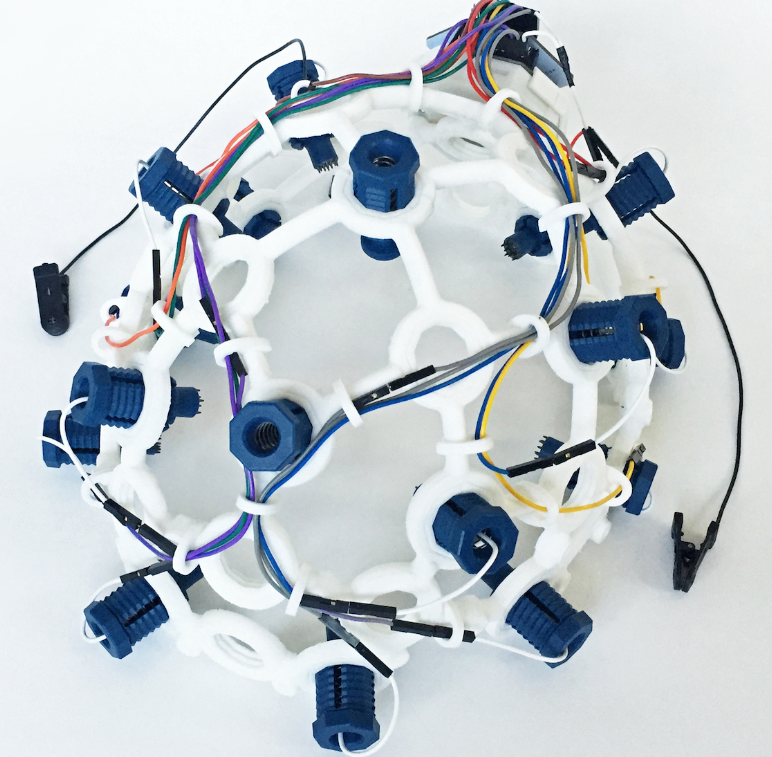

# Laboratorio 5 - Adquisición de señales de ECG

## Tabla de contenido
- [Introducción](#Introducción_al_laboratorio )
- [Materiales](#Materiales)
- [Metodología](#Metodología)
- [Resultados y discusión](#Resultadosydiscusión)
- [Conclusiones](#Conclusiones) 
- [Bibliografía](#Bibliografía)

## Introducción al laboratorio 
El presente laboratorio consiste en el uso del encefalograma (ECG) para adquirir y analizar las respuestas electricas del cerebro de los participantes. Esto se realizo mediante el uso del módulo Bitalino y el Ultracortex MarK IV. EL EEG son señales producidas por la actividad sinaptica de las neuronas y sirve para diferentes actividades entre las que destacan son el diagnositco de tumores cerebrales, encefalitis herpética, ACV, daños cerebrales por contusiones, encefalopatia y epilepsia.

El EEG usa electrodos, los cuales se colocan según el sistema 10-20 en el cuero cabelludo como se puede apreciar en la siguiente imagen. Cabe destacar que el CZ, C3 y C4 son los electrodos. [1]

El EEG consiste de 6 bandas de paso y cada una indica una función especifica del cerebro: [2]
- Delta 0.5Hz - 4Hz
- Theta 4Hz - 7.5 Hz
- Alpha 8Hz - 12Hz
- Beta 14Hz - 26Hz
- Gamma >30Hz
- Sigma 12Hz - 15Hz
## Materiales
| Materiales | Imagen referencial | 
|----------|----------|
|**Ultracortex Mark IV:** El Ultracortex es un casco de código abierto que se puede imprimir en 3D y ha sido desarrollado para ser compatible con el sistema OpenBCI. Este dispositivo es capaz de capturar señales de alta calidad utilizadas en investigaciones, incluyendo la actividad cerebral (EEG), la actividad muscular (EMG) y la actividad cardíaca (ECG). |  | 
| **BITalino:** Placa encaragda de la adquisición de señales tales como EEG, ECG y EMG. Además, incluye un software llamado Open source para la visualización de las señales.    |   | 
| **Laptop:** Dispositivo que posea los sowftware de visualización instalados.    |   | 
| **Electrodos:** Parche que contiene pegamento y filamentos metalicos que permiten la conducción de señales electricas del paciente hacia el dispositivo de medición.        |  |

## Metodología

## Resultados y discusión
- Ultracortex MarK IV
    - Abrir y cerrar ojos
    - Preguntas simples y complejas
- Módulo Bitalino
    
    Para la toma de datos del bitalino, se determino una frecuencia de sampelo de 100 Hz.
    - Mantener respiración con ojos cerrados
    - Abrir y cerrar ojos
    - Preguntas simples y complejas:
        
        
        
        
        
        
    Para el caso de las preguntas simples se puede observar que no hay mucha actividad en las ondas, ya que las preguntas se pueden responder de manera rapida y precisa, sin necesitar de mucho ejercicio mental. En cambio, en las preguntas complejas hay mucha más amplitud debido a que hay una mayor actividad cerebral para analizar y responder cada pregunta. En este caso es importante destacar que los resultados obtenidos no presentan valores negativos, lo cual resulta curioso, ya que la amplitud de los milivoltios debería abarcar el intervalo positivo y negativo, además, en el archivo .txt todos los resultados son positivos, por lo que, se puede intuir que hubo un problema durante la recolección de datos. Asimismo, se debería esperar según la bibliografia encontrada que hayan ondas cerebrales de alta frecuencia y amplitud en las preguntas complejas, ya que son indicativas de que existe un mayor nivel de actividad cerebral. Específicamente, en estas situaciones, se han identificado dos tipos de ondas cerebrales:
    - Las ondas beta, que oscilan entre 13 y 30 Hz, se relacionan con la actividad cerebral consciente y alerta. Se ha observado un aumento en la actividad beta en las áreas del cerebro encargadas del cálculo y la resolución de problemas.[3]
    - Las ondas gamma, con una frecuencia entre 30 y 100 Hz, se asocian con el procesamiento complejo de información en el cerebro. En preguntas de cálculo complejo, se ha notado un incremento en la actividad gamma en regiones cerebrales responsables del pensamiento, la memoria y la atención.[3]

**Videos**
- Abrir y cerrar los ojos:
<video src="Videos/cerrando_ojos.mp4" controls title="Title"></video>
- Preguntas simples y complejas:

## Conclusiones
- Se pudo observar la actividad cerebral que implica realizar un calculo mental, sobre todo, cuando hay picos grandes de milivoltios en el EEG.
- Las ondas gama y beta son las que se necesitan observar y comparar cuando se realizan calculos mentales de alto y baja nivel de complejidad.
## Bibliografía

- [1]Electroencefalografía. Garza N(Ed.), (2015). Manual de laboratorio de fisiología, 6e. McGraw Hill. https://accessmedicina.mhmedical.com/content.aspx?bookid=1722&sectionid=116884120
- [2] Universidad del Norte. División de Ingenierías. Departamento de Ingenierías Eléctrica y Electrónica. (2009). [CLASIFICACIÓN DE SEÑALES EEG PARA APLICACIONES EN EL DESARROLLO DE INTERFACES HOMBRE - MÁQUINA]. Tratamiento de señales EEG, selección y extracción de características y clasificación mediante análisis discriminante, redes neuronales artificiales y máquinas de soporte vectorial. Autor: Jaime Fernando Delgado Saa
- [3] Puertas Martínez, P. (2018). Estimación de Estados Cognitivos en Base a Ondas Cerebrales: Aplicación Práctica con Redes Neuronales. Universidad Politécnica de Madrid.