# Laboratorio 8 - Extracción de características EMG

## Tabla de contenido
- [Introducción](#Introducción)
- [Materiales](#Materiales)
- [Metodología](#Metodología)
- [Resultados y discusión](#Resultadosydiscusión)
- [Conclusiones](#Conclusiones) 
- [Bibliografía](#Bibliografía)

# Introducción
La extracción de características es ampliamente desarrollado en el procesamiento de señales, este se basa en extraer características notables de una señal, tales como la frecuencia, forma de onda y la amplitud. Posteriormente, estas características pueden ser utilizadas para el reconocimiento de patrones en la señal que pueden servir para clasificar o predecir su comportamiento en el futuro. Las aplicaciones de eextraccion de características de señales EMG están relacionadas al control de prótesis de miembro superior.
En este laboratorio se extraerán las principales características de la señal EMG previamente adquiridas y fltradas en anteriores laboratorios. Estas características son las siguientes: RMS, media,etc. [1]
# Materiales
- Señal filtrada de EMG 
- Computadora con el software instalado de Python 
# Metodología
Las señales de EMG fueron adquiridas a través del módulo BITalino, luego fueron procesadas y filtradas por los siguientes filtros: Wavelet, Butterwort y FIR. Esto con la finalidad de separa el ruido que interfiere durante la adquisición de datos. Finalmente, se empleo la libreria Numpy en Python para obtener los parametros tales como el valor máximo, valor mínimo, media, desviación estandar, RMS y el área. En el codigo adjuntado se presenta que comandos se emplearon para obtener estos valores al igual que la programación empleada para el filtrado de la señal.
# Resultados y discusión

| Señal | Filtro Wavelet | Filto Butterworth| Filtro FIR|
|:------------- |:---------------:| :---------------:| ---------------:| 
| 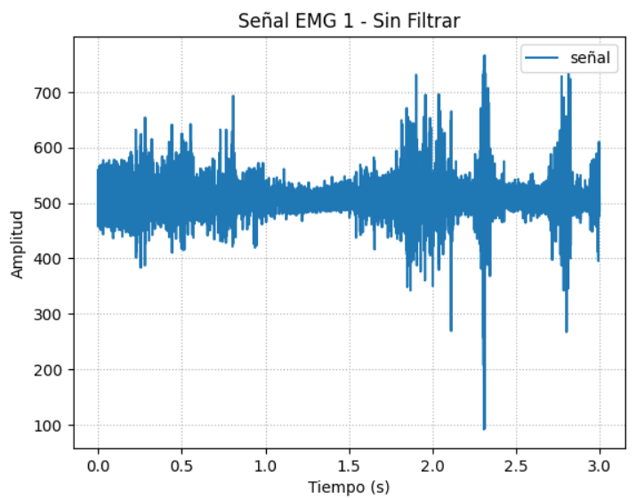      | 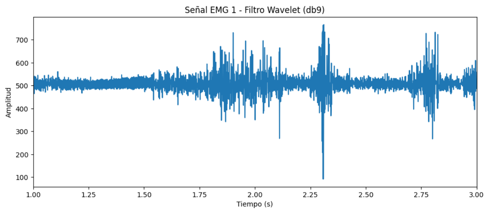        | 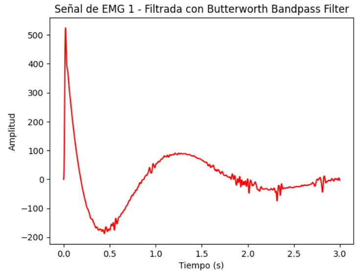|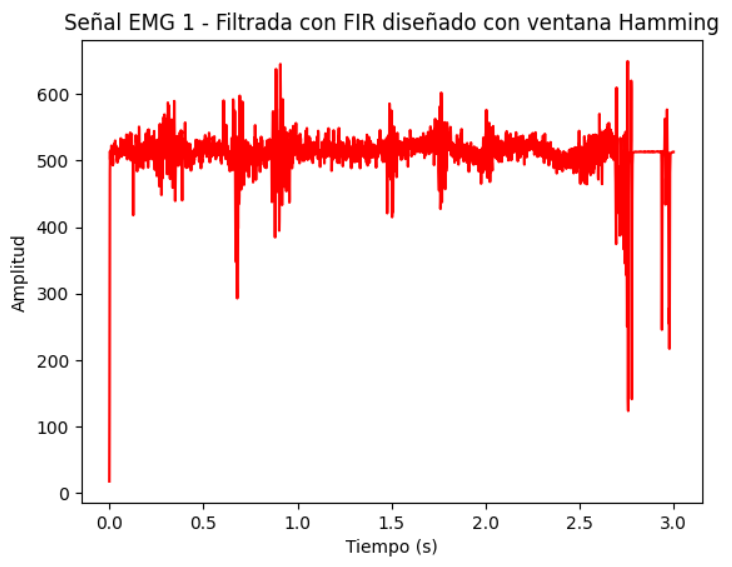 |
| 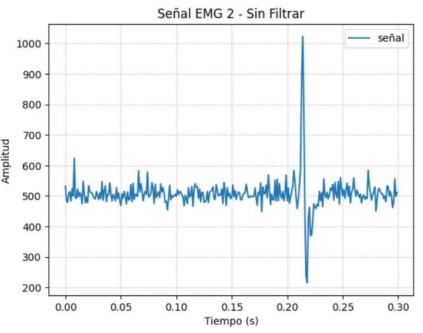         | 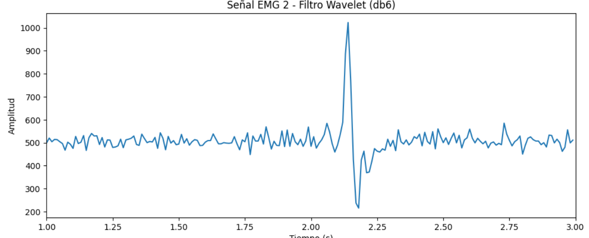        | 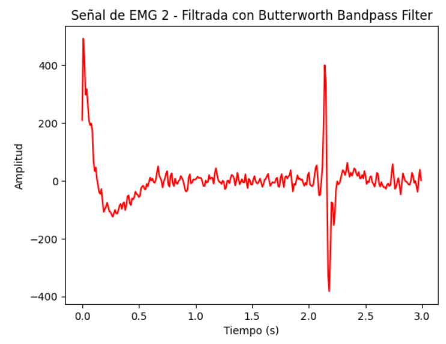| 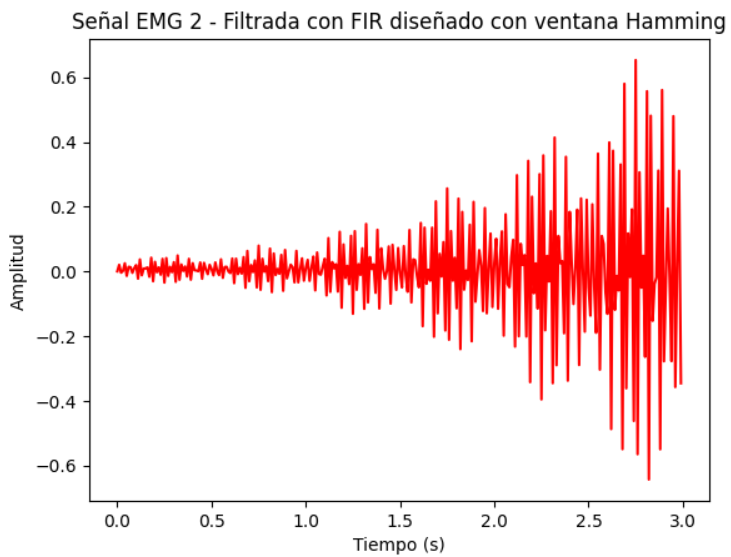|
| 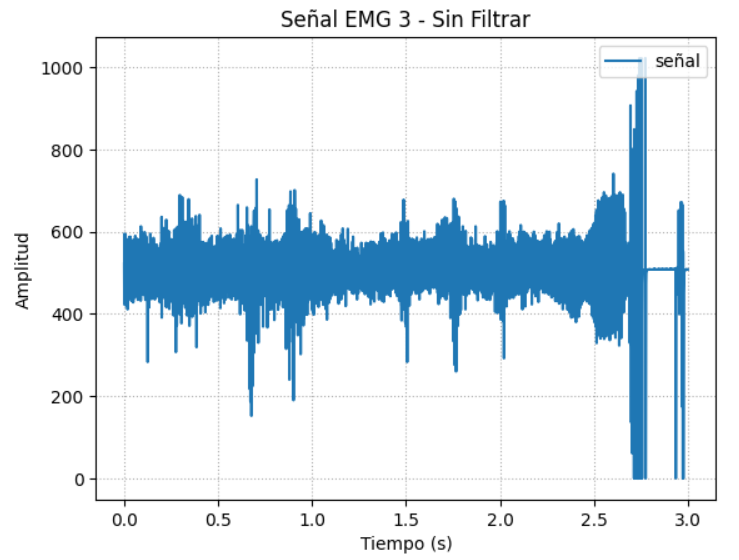        | 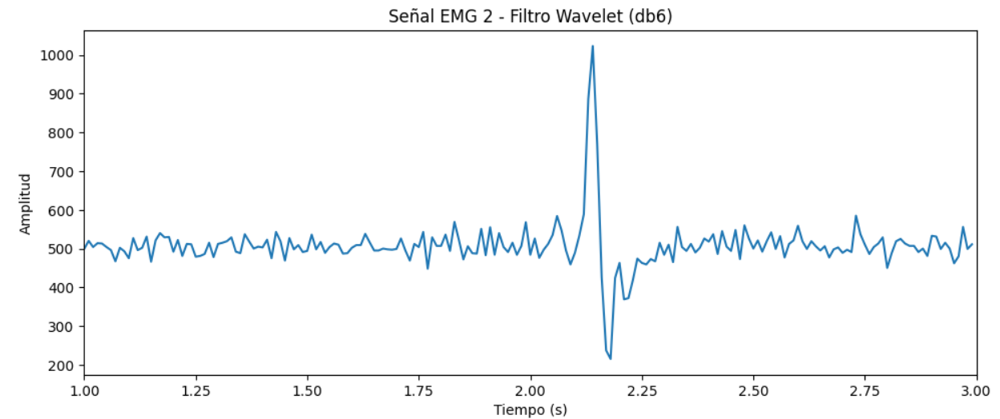        |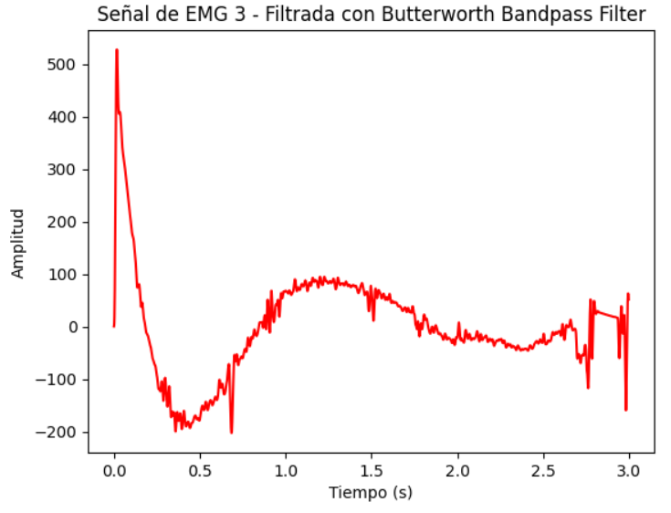 | 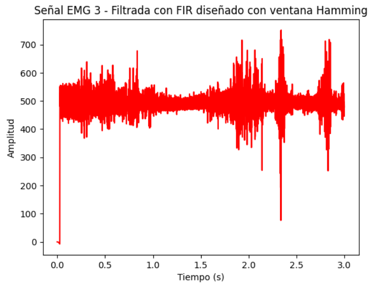|

Para los datos extraidos de la señal de EMG se evaluaron y obtuvieron los siguientes parametros:

- Valor máximo de EMG: 1022.0
- Valor mínimo de EMG: 0.0
- Media de EMG: 506.03766666666667
- Desviación estandar de EMG: 85.95689761670606
- RMS EMG: 9.371280743728564
- Área del EMG: 1517.598

La evaluación de parámetros electromiográficos desempeña un papel fundamental en la comprensión y monitorización de la actividad muscular en una variedad de campos, desde la medicina y la rehabilitación hasta la investigación en biomecánica y deportes. Estos parámetros proporcionan información clave sobre la función muscular, permitiendo a los profesionales de la salud, científicos y entrenadores entender en profundidad el comportamiento de los músculos. Por lo que es importante destacar que significa cada parametro y por qué es utíl para el paciente.

- EMG Máximo: Este valor representa la amplitud máxima de la señal EMG registrada. Puede ser útil para identificar la máxima actividad eléctrica generada por un músculo en un período de tiempo específico. Por ejemplo, en la evaluación de la fuerza muscular y para este paciente fue de 1022 mA.[2]

- EMG Mínimo: Indica la actividad eléctrica más baja registrada en la señal EMG. Puede ser relevante para conocer el nivel basal o de reposo de la actividad muscular. En este caso el nivel de reposo del paciente es de 0 mA. [3]

- EMG Promedio: Representa el promedio de la actividad eléctrica registrada a lo largo del tiempo. Es útil para obtener una medida general de la actividad muscular en un período específico. A partir de esto, se puede inferir que la actividad promedio que realiza este paciente durante su día a día es de 506.0376 mA[4]

- Desviación Estándar EMG: La desviación estándar mide la variabilidad en la señal EMG. Un valor alto indica que la actividad muscular varía significativamente, mientras que un valor bajo sugiere una actividad más constante. Puede ser útil para evaluar la estabilidad de la actividad muscular. La desviación estandar que presenta este paciente indica que sus niveles varian demasiado, lo cual tiene sentido, ya que los musculos no suelen estan contraidos todo el tiempo y varian en función al uso del paciente.[5]

- EMG RMS: La raíz cuadrada de la media de los cuadrados de la señal EMG. Se utiliza para obtener una estimación de la amplitud efectiva de la señal, lo que puede ayudar a caracterizar la fuerza muscular. Además de indicar como varia el valor máximo a través de este periodo tiempo. En este caso, un valor RMS de 9.37 sugiere que la señal tiene una amplitud promedio que es equivalente a una señal continua constante de 9.37 unidades en terminos de actividad electríca. [6]

- Área EMG: Representa el área bajo la curva de la señal EMG, que está relacionada con la cantidad total de actividad eléctrica registrada. Puede ser útil para evaluar la carga muscular o el trabajo realizado por un músculo. En este caso indica que hubo una gran cantidad de actividad electrica al moemento de realizar los ejercicios pedidos. [6]

# Conclusiones

# Bibliografía
- [1] L. Sanabria y O. Avilez, “Extracción de características y métodos de clasificación para reconocimiento de movimientos de mano a partir de señales de EMG y EEG: Revisión”, Revista Ingeniería Biomédica, vol. 14, no. 28, pp. 3-16, 2020.
- [2]•	J. Diong, K. C. Kishimoto, J. E. Butler y M. E. Héroux, “Muscle electromyographic activity normalized to maximal muscle activity, not to M max, better represents voluntary activation”, PLoS ONE, vol. 17, no. 11, e0277947, 2022. [Online]. Disponible: https://doi.org/10.1371/journal.pone.0277947
- [3] •	M. A. Al-Mamun y M. A. Hannan, “EMG Pattern Recognition: A Systematic Review”, en Advances in Intelligent Systems and Computing, vol. 1150, S. M. Thampi, S. Abraham y J. Kacprzyk, Eds. Cham: Springer, 2020, pp. 109-118. [Online]. Disponible: https://link.springer.com/chapter/10.1007/978-3-031-13150-9_10
- [4] •	T. J. Roberts y A. M. Gabaldo´n, “Interpreting muscle function from EMG: lessons learned from direct measurements of muscle force”, Integrative and Comparative Biology, vol. 48, no. 2, pp. 312-320, 2008. [Online]. Disponible: https://doi.org/10.1093/icb/icn056
- [5] •	J. E. Héroux, J. Diong y J. E. Butler, “Optimal Estimation of EMG Standard Deviation (EMGσ) in Additive Measurement Noise: Model-Based Derivations and Their Implications”, IEEE Trans. Neural Syst. Rehabil. Eng., vol. 29, pp. 1-10, 2021. [Online]. Disponible: https://ieeexplore.ieee.org/document/9366930
- [6] •	Calderón Jiménez, C. Marín Marín y K. Flores Álvarez, “Estilo de citación y referencias Normas IEEE”, Instituto Tecnológico de Costa Rica, 2021. [Online]. Disponible: https://www.tec.ac.cr/sites/default/files/media/doc/normas_ieee_tec.pdf
