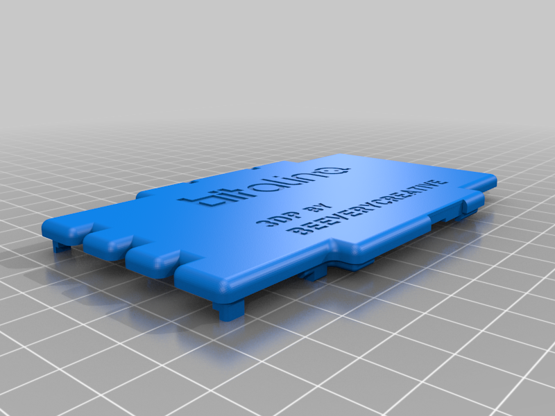
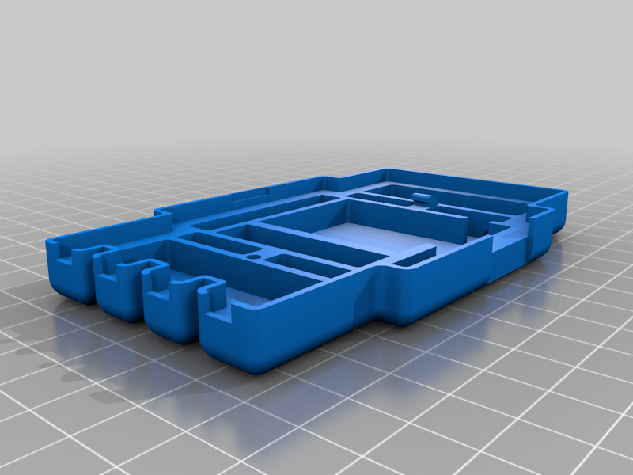
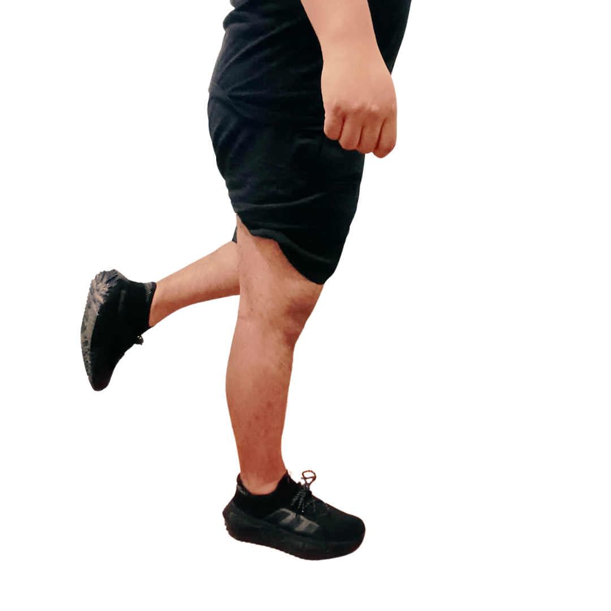
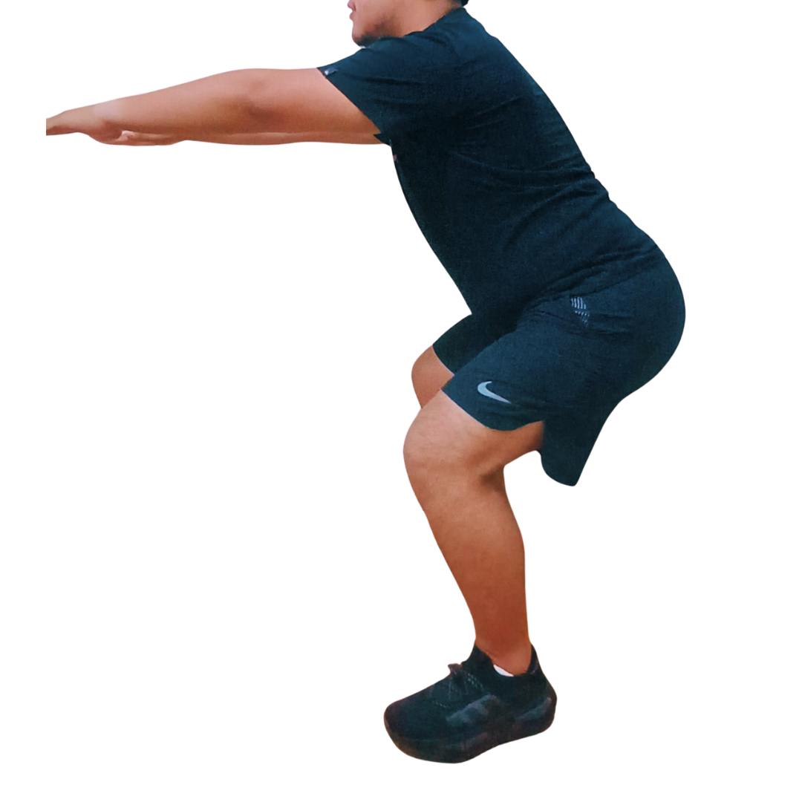
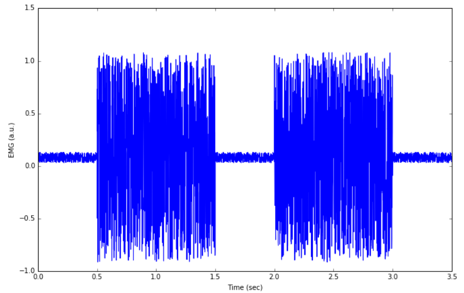
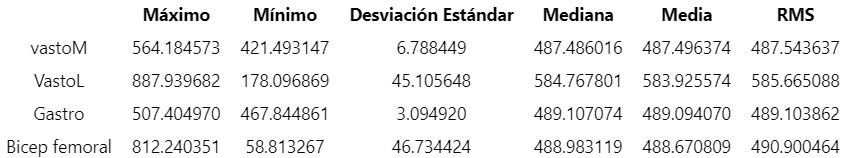
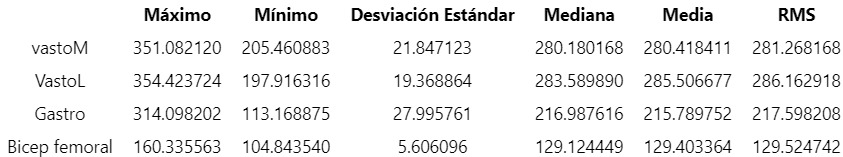
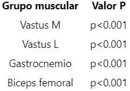

# Monitoreo de lesiones en el ligamento cruzado anterior en futbolistas de 18 a 40 años utilizando técnicas de procesamiento de señales EMG**

## Participantes
- Daniel Alejandro Aquije Niño de Guzman
- Nataly Gonzales 
- Giovani Taco
- Piero Miranda 
## Abstract

## Introducción
El fútbol, reconocido como uno de los deportes más practicados globalmente, expone a sus participantes a un riesgo significativo de lesiones musculoesqueléticas, entre las cuales la rotura del ligamento cruzado anterior (LCA) ha destacado por su incidencia y consecuencias incapacitantes. Este estudio se centra en analizar detalladamente la incidencia y la naturaleza de las lesiones del LCA en futbolistas, considerando el contexto en el cual estas lesiones se manifiestan y su impacto en la práctica deportiva. Con una prevalencia anual estimada del 5.2% en hombres y del 6.2% en mujeres, el LCA representa un área crítica de preocupación, cuya comprensión anatómica y biomecánica es fundamental para abordar los desafíos asociados con su prevención, diagnóstico y tratamiento.

Este documento busca proporcionar una visión holística de las lesiones del LCA en el contexto futbolístico, examinando la relación entre la actividad deportiva, la técnica gestual y la incidencia de estas lesiones. Además, se explorará un estudio de casos llevado a cabo en el Hospital Rebagliati entre 2000 y 2002, donde se realizaron cirugías reconstructivas del LCA, brindando datos relevantes sobre la efectividad de dichas intervenciones y los parámetros de recuperación asociados. En resumen, este trabajo aspira a contribuir al cuerpo de conocimiento existente sobre las lesiones del LCA en futbolistas, ofreciendo perspectivas que puedan mejorar la prevención, el manejo clínico y la recuperación de los afectados, en aras de preservar la integridad física y la continuidad en la práctica deportiva de estos atletas.

## Planteamiento del problema
Necesidad de un método para cuantificar la alteración del 	control neuromuscular después de una lesión del ligamento 	cruzado anterior en pacientes varones de 18 a 40 años.

## Estado del arte
En el ámbito de la investigación sobre la rehabilitación de la rodilla, se han explorado diversas metodologías para evaluar la fatiga muscular y mejorar los programas de entrenamiento. Kim et al. propusieron un método de evaluación basado en señales de electromiografía (EMG) para la rehabilitación de la rodilla, que no solo proporciona información fragmentaria como la potencia muscular, sino también detalles sobre la fatiga muscular [1]. Este enfoque se validó mediante la realización de ejercicios de elevación recta de piernas, y los resultados sugieren la utilidad de parámetros como la tasa de cruce por cero (ZCR) y la amplitud de la tensión muscular (AMT) para cuantificar la fatiga muscular.

En otro estudio, se aplicó biofeedback electromiográfico (BF-EMG) en la rehabilitación de lesiones de rodilla en futbolistas profesionales [2]. El BF-EMG, reconocido por su eficacia en trastornos neuromusculares, se integró como estrategia complementaria al plan de rehabilitación convencional. Los resultados demostraron un aumento en la actividad EMG del vasto externo, sugiriendo una mejora en la recuperación.
Además, Linderman et al. exploraron la aplicación de sensores de mecanomiografía superficial (sMMG) para evaluar la contracción muscular del cuádriceps durante tareas dinámicas [3]. Comparado con la electromiografía (EMG), el sMMG demostró ser una alternativa viable, proporcionando datos precisos durante sentadillas bilaterales y unipodales.

En el ámbito comercial, dispositivos como el Neurotrac® EMG Biofeedback System y Myoton® Pro han ofrecido soluciones para medir y entrenar respuestas musculares [4][5]. El Neurotrac® se ha utilizado en fisioterapia, especialmente para incontinencia, músculos dañados y rehabilitación post-ictus. Por otro lado, el Myoton® Pro destaca por su capacidad de palpación digital no invasiva y su aplicación en la investigación científica para medir propiedades biomecánicas y viscoelásticas del tejido.

## Metodología
La metodología realizada para el desarrollo del proyecto se divide en 5 etapas: Modelado 3D, adquisición, procesamiento, extracción de características y análisis estadístico. A continuación, se detallan los procesos y las herramientas utilizadas de cada etapa.
1. **Modelado 3D**
La carcasa del BITalino servirá como dispositivo de monitoreo a lo largo de sesiones de rehabilitación, ya que permitirá registrar las señales fisiológicas del paciente durante los ejercicios y evaluar su progreso. Para facilitar su uso y protegerlo de posibles daños, se ha diseñado una carcasa de plástico en 3D, la cual tiene aberturas para los conectores y los sensores del módulo BITalino, así como un sistema de sujeción para colocarlo en la pierna del paciente.

 
Fig. 1. Vista superior e inferior de la carcasa del módulo BITalino. Fuente: BEE Very Creative

2. **Adquisición de señales**
2.1. **Señales EMG de sujeto sin ACL**
Las señales se obtuvieron utilizando el módulo del BITalino y electrodos  en un participante masculino que realizó una serie de ejercicios para recolectar la actividad eléctrica de los siguientes músculos: Vastus medialis, Vastus lateralis, Biceps Femoris y Gastrocnemio. Antes de realizar los ejercicios para adquirir la data de la actividad muscular, el participante realizó un calentamiento por 3 minutos, el cual consistió en hacer saltos de tijera y trotar. Posteriormente, el participante tuvo un descanso de 1 minuto y se limpiaron las zonas utilizando alcohol isopropílico para colocar los electrodos. Dado que el cable del BITalino solo permitía conectar 3 electrodos a la vez, se utilizaron 2 de ellos para diferentes músculos y el otro electrodo se utilizó como conexión a tierra, el cual fue colocado en el hueso de la rodilla. Asimismo, se realizaron 2 veces los ejercicios para adquirir la data de todos los músculos. Los ejercicios realizados por el participante son los siguientes:

a. Contracción muscular voluntaria 
Este tipo de contracción muscular consiste en que el participante contraiga  con  intención el tren inferior  durante 5 segundos. Este ejercicio permite medir la actividad eléctrica generada por las fibras musculares y evaluar el desempeño muscular y funcional de la persona.

Fig. 2.Contracción muscular

b. Sentadilla isométrica
La sentadilla isométrica se basa en colocar los pies alineados con los hombros, extender las manos al frente y bajar el torso hasta que la rodilla forme un ángulo de 90° y se debe permanecer 5 segundos en esa posición. Este ejercicio se utiliza para evaluar la fuerza y el rendimiento muscular de la persona.

Fig. 3. Sentadilla isométrica

c. Salto con una pierna 
Consiste en colocarse de pie sobre una pierna y saltar hacia arriba, manteniendo la otra pierna en el aire. Luego, se debe aterrizar sobre la misma pierna y mantener el equilibrio durante unos segundos antes de volver a saltar.

Fig. 4. Salto con una pierna

Por cada ejercicio se realizaron 5 repeticiones para obtener la mayor cantidad posible de datos para garantizar un buen análisis.

2.2 **Señales EMG de sujeto con ACL**
Las señales EMG se obtuvieron mediante un modelado sintético para cada músculo. Para ello se creó una señal de contracción muscular con 1000 valores aleatorios entre -1 y 1, desplazados en 0.08, que representan la activación del músculo. Luego, se creó una señal de estado de reposo con 500 valores aleatorios entre -0.05 y 0.05, desplazados en 0.08, que representan la ausencia de actividad eléctrica.Luego, se unieron ambas señales para obtener una señal EMG completa. Posteriormente, se definió un array de tiempo de la señal EMG, muestreada a una frecuencia de 1000 Hz, que indica el intervalo de tiempo entre cada dato. Finalmente, se grafico la señal EMG usando la función plot de matplotlib.pyplot, que muestra la variación de la señal en función del tiempo.

Fig. 5. Señal EMG sintética 

3.Procesamiento de las señales
3.1 **Señales EMG de sujeto sin ACL**

3.2 **Señales EMG de sujeto con ACL**
El procesamiento de señales EMG sintéticas de la actividad muscular consta de las siguientes etapas:
Eliminar la media EMG
Se calculó el valor medio de toda la señal EMG y se le restó a la señal original. En consecuencia, se eliminó el desplazamiento de la línea base y se centró la señal en cero voltios.
Filtrar la señal EMG
Se empleó un filtro pasa-banda digital Butterworth de 4º orden con frecuencias de corte de 20 y 450 Hz. Esto permitió pasar las frecuencias de la señal EMG que tienen mayor potencia espectral y eliminó el ruido o artefactos tanto de baja como alta frecuencia.
Rectificar la señal EMG
Se tomó el valor absoluto de todos los valores de la señal EMG para que todos los valores sean positivos y evitar que se cancelen al calcular la media EMG.

4. **Extracción de características**
En el proceso de extracción de características, se persiguió la determinación de la media de las señales como un indicador revelador de la señal basal tanto en individuos sanos como lesionados. Posteriormente, se procedió a identificar los valores máximos y mínimos con el propósito de obtener referencias de la amplitud de cada señal, permitiendo así comparaciones significativas. Se puso especial énfasis en el cálculo de la raíz media cuadrática (RMS) para cada grupo muscular en ambos estados de salud: sano y en rehabilitación. Este enfoque nos brinda la oportunidad de evaluar la activación de grupos musculares y la potencia que estos exhiben, proporcionando insights valiosos sobre la respuesta muscular en diferentes condiciones de salud. [6]
5. **Análisis estadístico**
En el análisis estadístico, se realizó la prueba de Shapiro-Wilk para evaluar la normalidad de las muestras de electromiografía (EMG), necesaria para confirmar la aleatoriedad en la distribución de los picos en la señal. Posteriormente, se llevó a cabo una prueba de ANOVA para diferenciar las medias de cada grupo muscular en los estados de salud: sano y en rehabilitación, con el objetivo de evidenciar diferencias notables entre los grupos. Finalmente, se aplicó la prueba de Wilcoxon, específica para comparar muestras pareadas, con el fin de confirmar la presencia de diferencias significativas entre ambos estados de salud, ofreciendo así una validación precisa de las disparidades identificadas.

## Resultados

A.  **Extracción de características de electromiografìa de una persona sana**

En los resultados derivados del análisis estadístico de electromiografía en una persona sana, se reveló una notable elevación en los valores máximos de milivoltios en los grupos musculares específicos examinados, tales como el vasto medial, vasto lateral, gastrocnemius y bíceps femoral. Estos resultados indican una destacada actividad eléctrica en dichos músculos durante la evaluación. Además, al considerar el valor de la raíz media cuadrática (RMS), que representa la potencia de la señal, se constata una medida significativa de la fuerza y la intensidad de la actividad muscular registrada. Este hallazgo subraya la robustez y la eficacia de la actividad eléctrica en los músculos analizados en el contexto de la persona sana. Cabe resaltar que no solo los valores máximos, sino también la media y la mediana de la actividad eléctrica en estos músculos son notablemente altos, reflejando así una consistencia y fuerza muscular destacadas en la persona evaluada.

**Tabla 1. Resultados estadísticos de electromiografía de una persona sana**

B. **Extracción de características de electromiografìa de una persona lesionada**

En los resultados de electromiografía (EMG) para una persona lesionada, se evidenció una marcada disminución en los valores en comparación con aquellos de una persona sana. Tanto el máximo valor como la media y la mediana de la señal registraron niveles significativamente inferiores. Específicamente, al analizar la raíz media cuadrática (RMS), se observó que este indicador era prácticamente la mitad del valor correspondiente en una persona sin lesiones. Esta reducción en los valores de EMG y, en particular, en el RMS, sugiere una disminución sustancial en la actividad eléctrica y la potencia de la señal muscular en el individuo lesionado en comparación con su contraparte saludable.

**Tabla 2.  Resultados estadísticos de electromiografía de una persona en rehabilitación**

C. **Pruebas estadísticas realizadas**

- **Prueba de Shapiro-Wilk:** Se lograron obtener valores de
p < 0.001, lo cual conduce al rechazo de la hipótesis nula. Este resultado sugiere que la muestra de la señal obtenida no se adhiere a una distribución normal, una observación coherente dada la naturaleza de la señal de electromiografía. La falta de regularidad en la ocurrencia de los picos, que indican la contracción muscular, contribuye a la no conformidad con una distribución normal. En el contexto de la electromiografía, la imprevisibilidad en el momento de las contracciones musculares respalda la significativa diferencia respecto a una distribución normal, justificando así el rechazo de la hipótesis nula.

**Tabla 3. Resultados de la prueba de Shapiro-Wilk**

- **Prueba de Anova:** Los resultados de la prueba ANOVA revelaron valores de p<0.001, lo que lleva al rechazo de la hipótesis nula. Dentro del marco de esta prueba, se evidencia de manera concluyente la presencia de diferencias significativas al comparar las medias de los grupos musculares entre individuos saludables y aquellos en proceso de rehabilitación. 

**Tabla 4. Resultados de la prueba de ANOVA**

- **Prueba de Wilcoxon:** En relación con la prueba de Wilcoxon, diseñada específicamente para muestras pareadas, se ha obtenido un valor de p < 0.001. Esta significativa diferencia conduce al rechazo de la hipótesis nula. Dentro del marco de esta prueba, se establece de manera concluyente que existen disparidades significativas entre las muestras de una persona en proceso de rehabilitación por una lesión de ligamento cruzado anterior y una persona completamente sana.

**Tabla 5. Resultados de la prueba de Wilcoxon**

## Conclusiones
- Se evidencio estadísticamente que existe una diferencia significativa entre pacientes en rehabilitación después de una lesión de ligamento cruzado anterior y los sanos.
- Se puede evaluar el estado de salud de un paciente en rehabilitación con la técnica de electromiografía mediante la extracción de características seleccionadas.

## Referencias 
